# Ottomark

Turn gameplay footage into scroll-stopping UGC reels — scripted, voiced, and thumbnailed by Gemini.

## What it does

Ottomark takes a raw gameplay video and produces ready-to-post short-form UGC commentary reels for Instagram and TikTok. The user uploads footage, picks (or creates) a character persona, and the system handles the rest: video analysis, script generation, voice synthesis, and thumbnail art. The output is a set of 9:16 vertical reels with AI-generated voiceover and styled thumbnails — content that looks like it came from a real creator, not a pipeline.

Game developers can use this to generate authentic-feeling marketing content for early builds without hiring creators or waiting for organic coverage.

## System architecture

```mermaid
flowchart TB
    subgraph Input
        A["🎮 Gameplay Video"]
        B["🧑‍🎤 Character Persona<br/><i>personality · voice · backstory</i>"]
    end

    subgraph Upload ["Gemini Files API"]
        C["Resumable Upload<br/><code>POST /upload/v1beta/files</code>"]
    end

    subgraph Analysis ["Stage 1 — Video Analysis"]
        D["<b>gemini-3-flash-preview</b><br/>12-category structured brief<br/><i>game identity · play-by-play · highlights<br/>hook analysis · tone · timestamps</i>"]
    end

    subgraph Script ["Stage 2 — Script Generation"]
        E["<b>gemini-3.x-pro</b> <i>(fallback chain)</i><br/>Reel type selection from 12-category taxonomy<br/>+ timestamped SRT dialogue"]
        F["<b>Refinement pass</b><br/>130–155 WPM pacing · voice fidelity<br/>narrative arc · SRT repair"]
    end

    subgraph Thumbnails ["Stage 3 — Thumbnail Generation (parallel)"]
        direction LR
        G1["🎬 Cinematic"]
        G2["💥 Comic"]
        G3["🌆 Neon"]
    end
    G["<b>gemini-2.0-flash-preview-image-generation</b><br/>9:16 portrait · 3 styles via <code>Promise.allSettled</code>"]

    subgraph Voice ["Stage 4 — Voice Synthesis"]
        H["<b>Gemini TTS</b><br/>Puck · Algenib · Algieba · Zubenelgenubi · Sulafat<br/><i>SRT timestamps drive voiceover timing</i>"]
    end

    subgraph Output ["Output"]
        I["3× Vertical Reel Cards (9:16)<br/><i>video + voiceover + thumbnail + script</i>"]
    end

    A --> C
    C --> D
    B --> E
    D -- "analysis brief" --> E
    E --> F
    F -- "gameplay context" --> G
    G --> G1 & G2 & G3
    F -- "SRT script" --> H
    G1 & G2 & G3 --> I
    H --> I
```



## Motivation

Indie and mid-size game studios face a cold start problem: they need UGC-style content to drive wishlists and community feedback, but no one is making content about a game nobody knows exists yet. Hiring creators is expensive and slow. Ottomark closes that gap — give it gameplay footage and a character voice, and it produces the kind of short-form commentary reels that actually perform on social platforms.

## How Gemini powers the pipeline

The generation pipeline chains four Gemini model calls, each handling a distinct stage:

### 1. Video analysis — `gemini-3-flash-preview`

The raw gameplay file is uploaded via the Gemini Files API (resumable upload protocol) and passed to `gemini-3-flash-preview` with a structured analysis prompt. The model produces a detailed brief covering 12 categories: game identity, content spine, visual play-by-play with timestamps, hook analysis, highlight moments, tone, on-screen text extraction, and more. This brief becomes the shared context for all downstream generation.

### 2. Script generation — `gemini-3.1-pro` / `gemini-3-pro` / `gemini-2.5-pro`

The analysis brief and a character profile (personality, voice style, optional freeform markdown backstory) are fed into a two-pass script generation pipeline:

- **Pass 1**: A Pro-tier model selects the optimal reel type from a 12-category taxonomy (reaction, hot take, storytime, tips, challenge, skeptic convert, rage/fail, satisfying showcase, comparison, hype/first look, nostalgia trip, POV/roleplay) and generates a timestamped SRT script aligned to the character's voice and the footage's strongest moments.
- **Pass 2**: A refinement pass enforces timing feasibility (130–155 WPM pacing), character voice fidelity, and narrative arc coherence. If the output lacks valid SRT blocks, an automatic repair pass re-generates just the subtitle formatting.

The system uses a model fallback chain (`gemini-3.1-pro` → `gemini-3-pro` → `gemini-2.5-pro`) — if the latest model is unavailable or errors, it degrades gracefully through stable alternatives.

### 3. Thumbnail generation — `gemini-2.0-flash-preview-image-generation`

Three thumbnails are generated in parallel using `Promise.allSettled`, each with a different visual style (cinematic, comic book, neon/synthwave). The model receives gameplay context (truncated to 500 chars) and produces 9:16 portrait images. Failures in any single style don't block the others.

### 4. Voice synthesis — Gemini TTS

Character voices map to Gemini TTS voice IDs (Puck, Algenib, Algieba, Zubenelgenubi, Sulafat) with distinct tonal qualities (upbeat, gravelly, smooth, casual, warm). The SRT timestamps from the script stage drive the voiceover timing.

## Tech stack

- **Next.js 16** (React 19) — App Router, server-side API routes
- **TypeScript 5** — end to end
- **Tailwind CSS 4** — custom design system with noise grain overlays, morphing blob animations, conic-gradient spinners
- **Gemini API** — direct REST calls to `generativelanguage.googleapis.com` (Files API, generateContent, image generation)
- **No external dependencies beyond React and Next.js** — zero AI SDK wrapper libraries, just raw HTTP against the Gemini REST API

## Running locally

```bash
cd ui
npm install
echo "GEMINI_API_KEY=your-key" > .env.local
npm run dev
```

## Built for

Google Gemini 3 Hackathon — Tokyo, 2026
